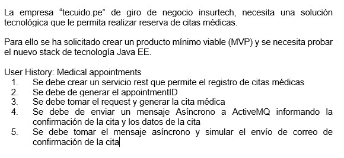
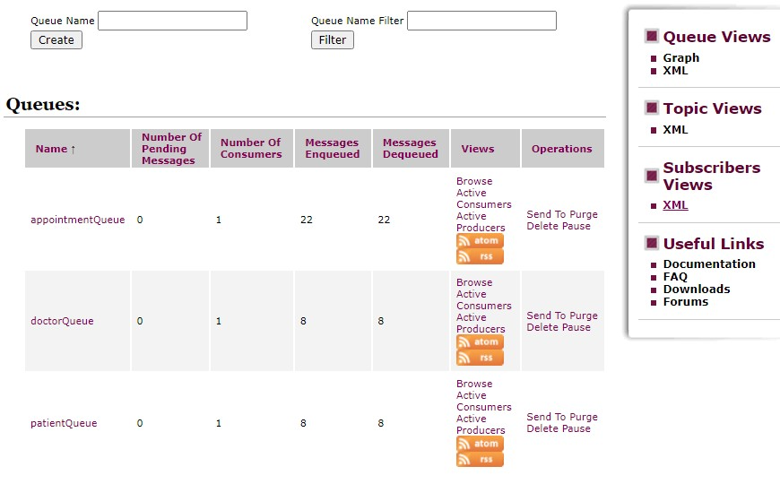
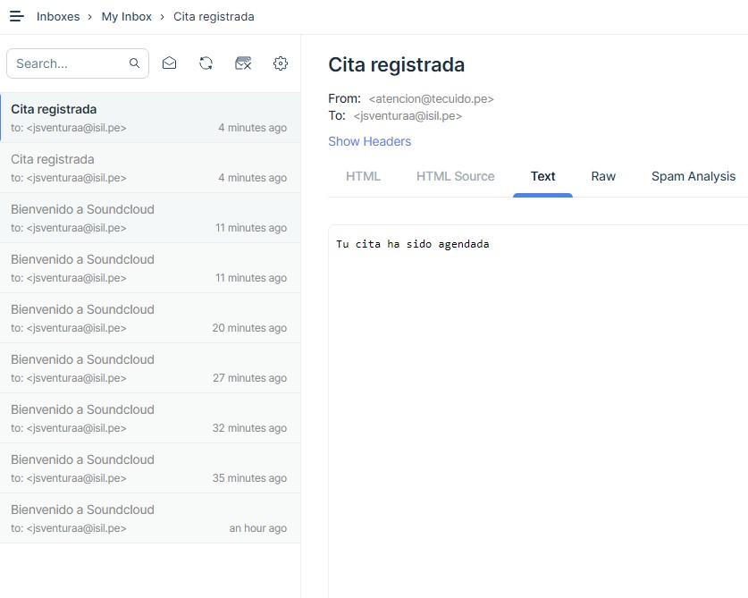
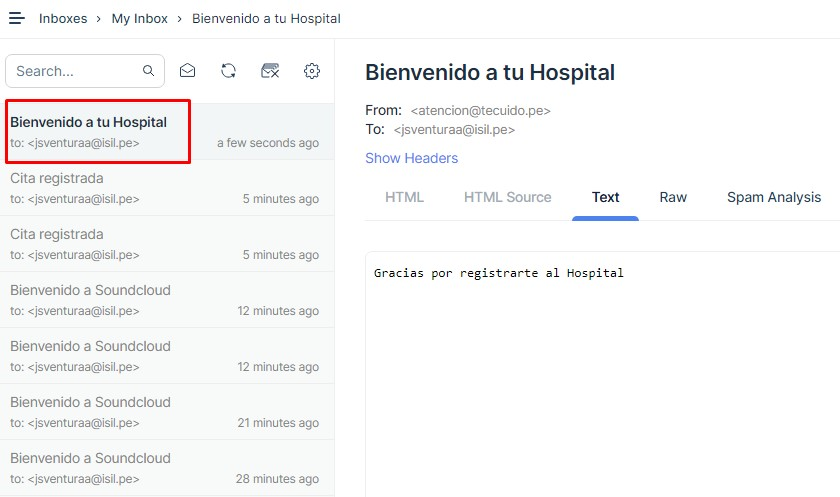

## 1. Problema

## 2. Colas en ActiveMQ

## 3. Envío de mensaje despues de reservar una cita

## 4. Envío de mensaje despues de que un paciente se crea una cuenta

RESOLUCIÓN (DOCUMENTACIÓN)

CREATED BY:

    {
        "Nombre": "Miluska Mirella Romero Torres"
    }

CREAR PACIENTE:

localhost:8086/api/patients/save 

    { 
        "firstName": "Jose",
        "lastName": "Ventura",
        "email": "jsventuraa@isil.pe",
        "weight": 65.3,
        "height": 1.7,
        "personalDisease": "asma",
        "bloodType": "O+"
    }

    
localhost:8086/api/doctors/save 

CREAR DOCTOR

    {
        "doctorId": 1,
        "firstName": "Jose",
        "lastName": "Ventura",
        "licenceNo": "761651",
        "specialty": "Neurología "
    }

localhost:8086/api/medical-appointments/save 

CREAR APPOINTMENT

    {
        "appointmentId": 14,
        "doctor": {
            "doctorId": 1,
            "firstName": "Jose",
            "lastName": "Ventura",
            "licenceNo": "7065165",
            "specialty": "Neurología "
        },
        "patient": {
            "patientId": 1,
            "firstName": "Jose",
            "lastName": "Ventura",
            "email": "jsventuraa@isil.pe",
            "weight": 65.3,
            "height": 1.7,
            "personalDisease": "asma",
            "bloodType": "O+"
        },
        "disease": "contractura muscular",
        "detail": "el paciente no puede girar la cabeza debido a dolor muscular",
        "dateOfAppointment": "2020-12-11",
        "timeOfAppointment": "10:30"
    }

## 5. CONSULTAR EN LA BASE DE DATOS:

localhost:8086/h2-console

spring.datasource.url=jdbc:h2:mem:isildb;DB_CLOSE_DELAY=-1

spring.datasource.username=isil

spring.datasource.password=isil 

## 6. Se necesita inicializar ActiveMQ para poder ver las colas.
 